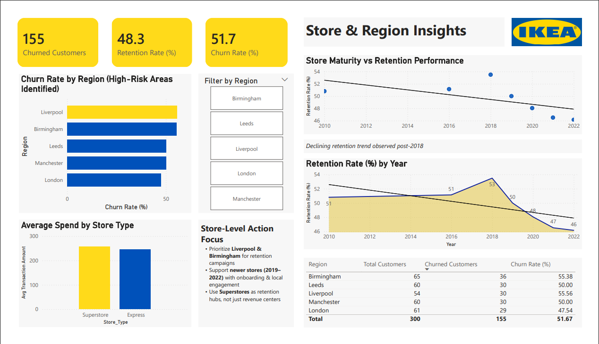
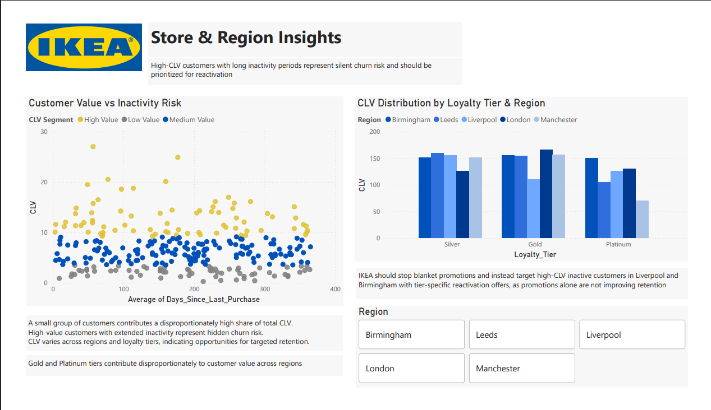
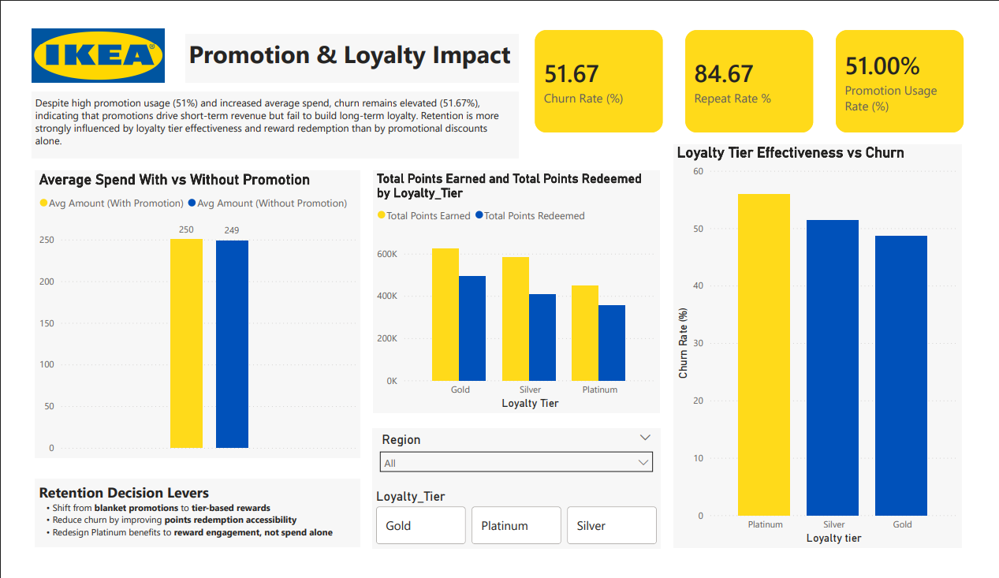

# IKEA Customer Retention Analytics

  

  

  

  

  

---

## 📌 Business Problem
Customer retention is a critical challenge in the retail industry. This project analyzes IKEA customer behavior to identify churn patterns, understand repeat purchase dynamics, and support data-driven retention strategies that improve long-term customer value.

---

## 📊 Project Overview
This project presents an interactive **Power BI dashboard** designed to analyze:
- Customer retention and churn trends
- Repeat purchase behavior across customer segments
- Revenue contribution by loyalty tiers
- Impact of promotions and loyalty programs on retention
- Regional and store-level retention performance

---

## 🔧 Tools & Technologies
- **Power BI**
- **DAX**
- **Excel / CSV**
- Data Modeling
- Data Cleaning & Transformation

---

## 📁 Dataset Description
The analysis is based on multiple structured datasets, including:
- Customer demographics
- Transaction history
- Loyalty program data
- Store and regional information
- Churn-labeled customer records

All datasets used in this project are available in the `data/` folder.

---

## 📈 Key Metrics & KPIs
- Customer Retention Rate  
- Churn Rate  
- Repeat Purchase Frequency  
- Customer Lifetime Value (CLV) indicators  
- Revenue by customer segment and region  

---

## 💡 Key Analytical Insights

### 1️⃣ Customer Retention by Segment
Certain customer segments demonstrate significantly higher retention, indicating strong loyalty and repeat engagement.

### 2️⃣ Churn Analysis
Churn is notably higher among low-frequency buyers, highlighting the need for targeted engagement and reactivation strategies rather than blanket promotions.

### 3️⃣ Repeat Purchase Trends
Customers enrolled in loyalty programs show higher repeat purchase frequency, reinforcing the importance of loyalty-driven retention.

### 4️⃣ Revenue Contribution by Customer Type
A relatively small group of loyal customers contributes a disproportionately large share of total revenue, emphasizing the value of retaining high-tier customers.

### 5️⃣ Store & Region Insights
Specific regions (notably Liverpool and Birmingham) exhibit higher churn rates, while store maturity and localized engagement play a key role in retention performance.

---

## 🎥 Dashboard Walkthrough (Video)
Due to file size limitations, the complete dashboard walkthrough video is hosted externally.

👉 **Watch the demo here:** _[Paste your public video link]_

(The same link is also referenced in the project documentation.)

---

## 📄 Documentation
Detailed documentation covering project objectives, methodology, assumptions, and insights is available in the `docs/` folder.

---

## 📦 Repository Structure
data/ → Datasets used for analysis
analysis/ → Analysis-related files
powerbi/ → Power BI (.pbix) dashboard
docs/ → Project documentation
exports/ → Exported reports (PDF / HTML)
resources/ → Images, logos, and supporting assets
insights/ → Dashboard screenshots used in README

---

## 🧾 Business Impact
This analysis helps identify at-risk customers, high-value inactive segments, and region-specific churn patterns. The insights support data-driven decisions to improve customer retention, increase repeat purchases, and enhance overall customer lifetime value through targeted loyalty and engagement strategies.

---

## 🔖 Notes
- This project is created for analytical and educational purposes.  
- All brand names and datasets are used strictly for demonstration purposes.  
